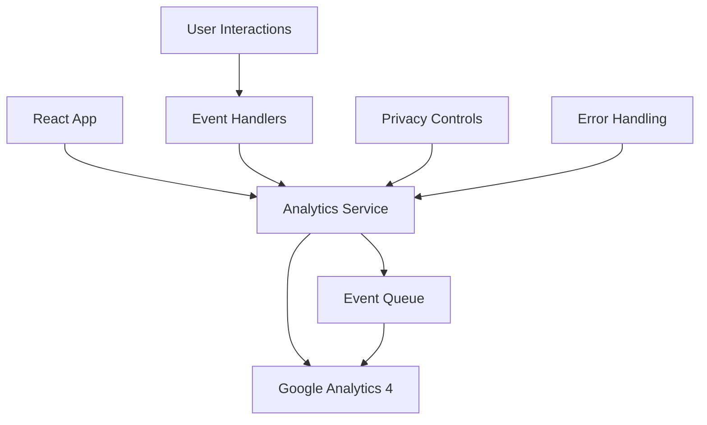

# Design Document

## Overview

The Google Analytics integration will be implemented as a lightweight tracking system using Google Analytics 4 (GA4). The design focuses on simplicity and maintainability while providing essential user interaction tracking for the bond calculator SPA.

The integration will use the Global Site Tag (gtag) approach with minimal configuration and will track key user interactions without impacting application performance or user experience.

## Architecture

### High-Level Architecture



### Component Integration

The analytics system will integrate with the existing React application structure:

- **App.tsx**: Initialize analytics on application startup
- **BondCalculator.tsx**: Track calculation events and user interactions
- **CurrencyContext.tsx**: Track currency preference changes
- **Analytics Service**: Centralized service for all tracking operations

## Components and Interfaces

### Analytics Service

A centralized service that handles all Google Analytics interactions:

```typescript
interface AnalyticsService {
  initialize(measurementId: string): void;
  trackPageView(path: string): void;
  trackEvent(eventName: string, parameters?: EventParameters): void;
  trackCalculation(calculationType: string, parameters?: CalculationParameters): void;
  trackUserInteraction(interaction: string, parameters?: InteractionParameters): void;
}

interface EventParameters {
  [key: string]: string | number | boolean;
}

interface CalculationParameters {
  bondType?: string;
  exitYearsCount?: number;
  salePricesCount?: number;
  currency?: string;
}

interface InteractionParameters {
  component?: string;
  action?: string;
  value?: string | number;
}
```

### Configuration

Environment-based configuration for different deployment environments:

```typescript
interface AnalyticsConfig {
  measurementId: string;
  enabled: boolean;
  debugMode: boolean;
}
```

### Event Types

Standardized event names for consistent tracking:

- `page_view`: Initial page load
- `bond_calculation`: When user performs a calculation
- `input_change`: When user modifies bond parameters
- `currency_change`: When user switches currency
- `exit_year_selection`: When user modifies exit years
- `sale_price_selection`: When user modifies sale prices

## Data Models

### Analytics Events

```typescript
type AnalyticsEvent = {
  event_name: string;
  timestamp: number;
  parameters: {
    page_title?: string;
    page_location?: string;
    currency?: string;
    calculation_type?: string;
    input_field?: string;
    interaction_type?: string;
    [key: string]: string | number | boolean | undefined;
  };
};
```

### User Session Data

```typescript
type SessionData = {
  session_id: string;
  session_start: number;
  page_views: number;
  calculations_performed: number;
  currency_used: string;
};
```

## Error Handling

### Graceful Degradation

The analytics system will implement comprehensive error handling:

1. **Script Loading Failures**: If GA4 script fails to load, the application continues normally
2. **Network Issues**: Events are queued and retried when connectivity is restored
3. **Privacy Blockers**: Detect ad blockers and privacy tools, continue without errors
4. **Invalid Events**: Validate event parameters before sending

### Error Recovery

```typescript
interface ErrorHandler {
  handleScriptLoadError(): void;
  handleEventSendError(event: AnalyticsEvent, error: Error): void;
  handlePrivacyBlocker(): void;
  retryFailedEvents(): void;
}
```

## Testing Strategy

### Unit Testing

- Test analytics service methods in isolation
- Mock Google Analytics gtag function
- Verify event parameter validation
- Test error handling scenarios

### Integration Testing

- Test analytics initialization in React app
- Verify event tracking from user interactions
- Test privacy blocker detection
- Validate session tracking across page interactions

### Manual Testing

- Verify events appear in Google Analytics Real-Time reports
- Test with ad blockers enabled
- Validate cross-browser compatibility
- Test session tracking with different usage patterns

## Implementation Details

### Initialization Flow

1. Load Google Analytics script asynchronously in index.html
2. Initialize analytics service in App.tsx
3. Set up error handlers and privacy detection
4. Begin tracking page view and user interactions

### Event Tracking Integration Points

- **BondCalculator.tsx**: Track calculation events when results are computed
- **BondDetailsSection.tsx**: Track input changes for bond parameters
- **CurrencySelector.tsx**: Track currency preference changes
- **SalePriceSelector.tsx** and **ExitYearSelector.tsx**: Track selection changes

### Privacy Considerations

- Use anonymous tracking (no personally identifiable information)
- Respect Do Not Track browser settings
- Implement consent management if required by regulations
- Provide opt-out mechanism through environment configuration

### Performance Optimization

- Load GA4 script asynchronously to avoid blocking page load
- Debounce rapid user interactions to avoid excessive event sending
- Queue events during initialization to prevent data loss
- Use minimal event parameters to reduce payload size

## Configuration Management

### Environment Variables

```typescript
// vite-env.d.ts
interface ImportMetaEnv {
  readonly VITE_GA_MEASUREMENT_ID: string;
  readonly VITE_GA_ENABLED: string;
  readonly VITE_GA_DEBUG: string;
}
```

### Build-time Configuration

- Development: Debug mode enabled, console logging
- Production: Optimized tracking, error reporting
- Testing: Analytics disabled or mocked

This design provides a simple, maintainable Google Analytics integration that meets all requirements while respecting user privacy and maintaining application performance.